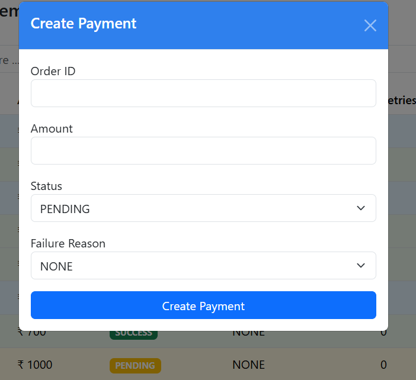
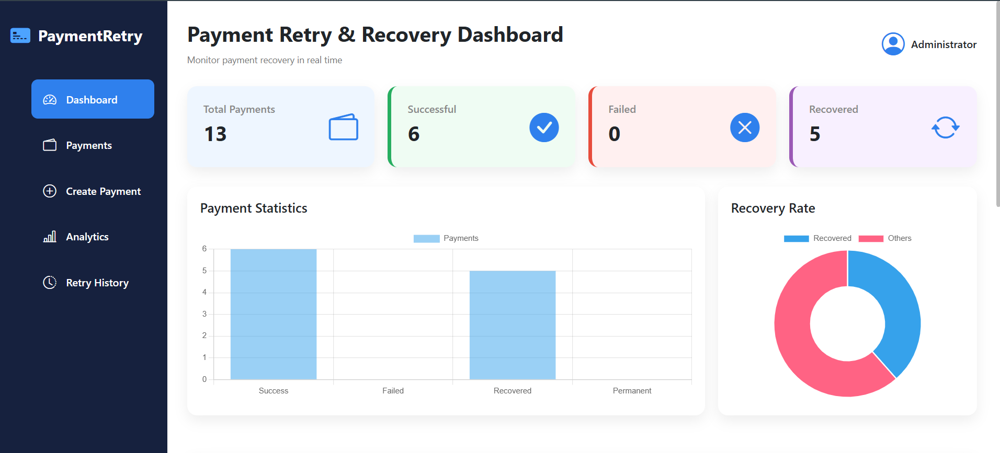
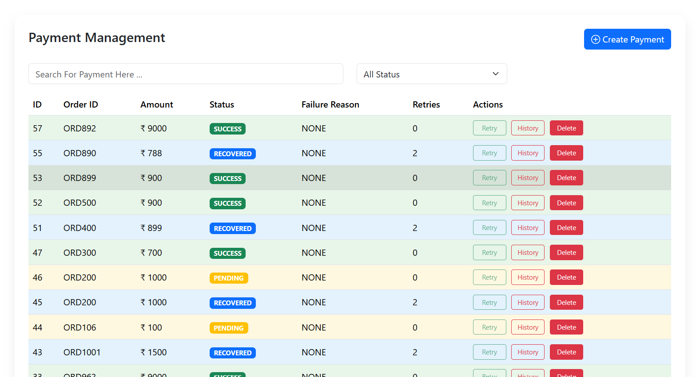
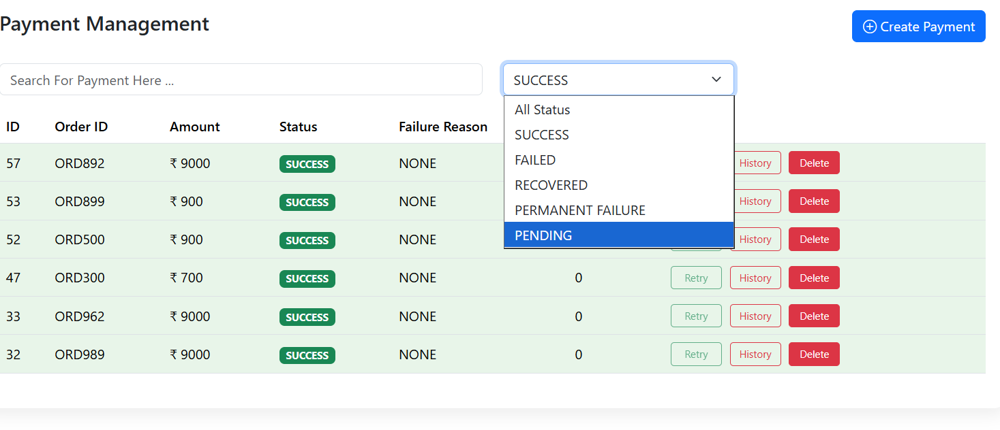
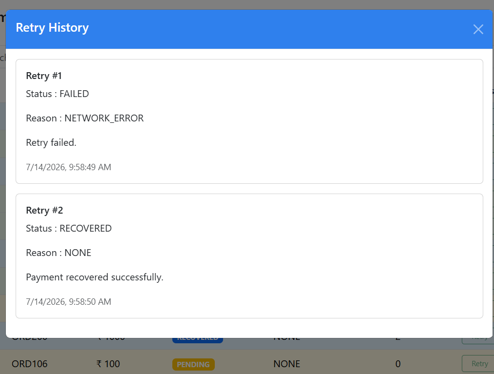
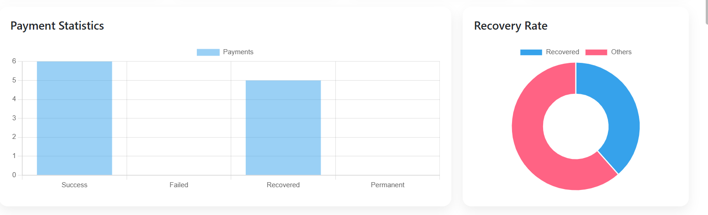

# 💳 Payment Retry & Recovery System


A full-stack **Spring Boot** web application that simulates a real-world payment processing system with automatic retry and recovery mechanisms. The application provides an interactive dashboard to monitor payments, retry failed transactions, and analyze payment statistics in real time.

## 🚀 Features
- 📊 Interactive Dashboard
  - Total Payments
  - Successful Payments
  - Failed Payments
  - Recovered Payments

- 💰 Payment Management
  - Create Payment
  - Delete Payment
  - View All Payments
  - Search Payments
  - Filter by Status

- 🔄 Payment Retry System
  - Retry failed payments
  - Maximum retry limit
  - Automatic recovery after successful retry
  - Retry history tracking

- ⏳ Pending Payment Processing
  - Pending payments are automatically processed after 10 seconds.
  - 70% chance of SUCCESS
  - 30% chance of FAILED with a random failure reason.

- 📈 Analytics
  - Bar Chart (Payment Statistics)
  - Doughnut Chart (Recovery Rate)

- 🎨 Modern UI
  - Responsive Dashboard
  - Toast Notifications
  - Colored Status Badges
  - Status-based Row Colors
  - Hover Effects
  - Sidebar Navigation

## 🛠️ Technologies Used

### Backend
- Java 17
- Spring Boot
- Spring Web
- Spring Data JPA
- Hibernate
- MySQL (optional / for local development)
- PostgreSQL (for Render deployment)
- Maven

### Frontend
- HTML5
- CSS3
- JavaScript (ES6)
- Bootstrap 5
- Bootstrap Icons
- Chart.js

### Database
- MySQL

## 📂 Project Structure

```
payment-retry-system
│
├── src
│   ├── main
│   │   ├── java
│   │   │   └── payment_retry_system
│   │   │       ├── controller
│   │   │       ├── dto
│   │   │       ├── model
│   │   │       ├── repository
│   │   │       └── service
│   │   │
│   │   └── resources
│   │       └── static
│   │           ├── css
│   │           ├── js
│   │           └── index.html
│   │
│   └── pom.xml
```
## ⚙️ How It Works
### Payment Flow

Create Payment
        │
        ▼
     PENDING
        │
        ▼
 Wait 10 Seconds
        │
        ▼
 ┌───────────────┐
 │               │
 ▼               ▼
SUCCESS       FAILED
                   │
                   ▼
             Retry Payment
                   │
          ┌───────────────┐
          ▼               ▼
     RECOVERED      PERMANENT FAILURE


## ScreenShots

# Create Payment Module


# Retry Payment and Recovery Dashboard


# Payment Table


# Payment Status


# Payment Retry History 


# Payment Analysis



## Getting Started
### Clone Repository

```bash
git clone https://github.com/YOUR_USERNAME/payment-retry-system.git
```

### Open Project

```bash
cd payment-retry-system
```

### Configure Database

Update `application.properties`

```properties
spring.datasource.url=jdbc:mysql://localhost:3306/payment_retry_system
spring.datasource.username=root
spring.datasource.password=YOUR_PASSWORD
```

### Run Application

```bash
mvn spring-boot:run
```

Open

```
http://localhost:8081
```
# Deployment Guide: PaymentRetryRecoverySystem

This guide covers how to deploy this Spring Boot application to Render, including the required PostgreSQL database connection.

## Prerequisites
- A [Render](https://render.com) account.
- A GitHub repository containing this code.
- A PostgreSQL database hosted on Render. 

## Step 1: Prepare your Code
Before deploying, ensure your `application.properties` or `application.yml` is configured to read environment variables rather than hardcoded credentials.

**Example `application.properties` setup:**
```properties
spring.datasource.url=${SPRING_DATASOURCE_URL}
# Or if you prefer using the common DATABASE_URL variable:
# spring.datasource.url=${DATABASE_URL}
spring.jpa.hibernate.ddl-auto=update
spring.jpa.properties.hibernate.dialect=org.hibernate.dialect.PostgreSQLDialect
```

## Step 2: Deploy on Render
Log in to Render and click New + > Web Service.

Connect your GitHub repository (nishu949/PaymentRetryRecoverySystem).

Configure the service:

Name: PaymentRetryRecoverySystem

Region: Oregon (or your preferred region).

Branch: main

Runtime: Docker (Since your service is a Spring Boot app, ensure your repository contains a valid Dockerfile for Render to build).

Plan: Starter / Free tier

## Step 3: Set up the Environment Variables (CRITICAL)
```
Key	                    Value
SPRING_DATASOURCE_URL   jdbc:postgresql://dpg-d9iubtsvikkc73d6ktm0-a/technews?user=technews_user&password=<YOUR_RENDER_DATABASE_PASSWORD>
```
## Step 4: Deploy the Service
Click the Manual Deploy button in the top-right corner of the Render dashboard.

Select Deploy latest commit.

##  Future Enhancements

- User Authentication
- Email Notifications
- Payment Gateway Integration
- Scheduled Retry Jobs
- Export Reports (CSV/PDF)
- REST API Documentation (Swagger)
- Role-Based Access Control

---

## 👨‍💻 Author

**Nishad Shaikh**

GitHub: https://github.com/nishu949
## 📄 License
This project is developed for educational purposes.
